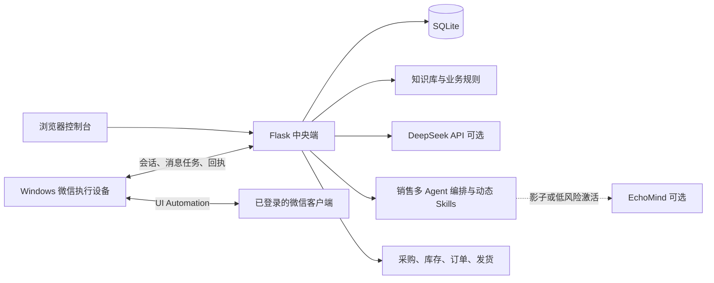

# Freshsales-Agent

> 面向榴莲及生鲜批发业务的本地化销售运营智能体：从门店线索、微信触达、知识库问答，到报价、采购、库存、订单和发货的一体化开源工作台。

当前公开版本：`0.2.0-alpha`

**Web 运营系统：** [Freshsales-Agent](https://freshsales-agent.liuluochen6.chatgpt.site)  
支持公开市场数据、企业 CSV 导入，以及报价、库存、履约、售后与合规 Agent 路由。

Freshsales-Agent 不是一个只会生成销售话术的聊天机器人。它把线索管理、Windows 微信 RPA、可追溯知识库、DeepSeek 语言组织、销售订单、批次库存和发货控制放在同一套本地系统中，目标是让小型供应链团队能够看清每个客户、每条消息、每次报价和每一笔库存变化。

项目仍处于 Alpha 阶段。请先阅读“当前边界”和“合规要求”，不要未经验证直接用于无人值守生产环境。

## 解决什么问题

许多生鲜批发团队的实际工作分散在 Excel、微信、记事本和多个进销存表格中，常见问题包括：

- 客户名单字段不统一，手机号、微信号、地区和来源难以追溯；
- 加好友、备注、记录结果依靠人工重复操作；
- 销售人员回答价格、运费和售后时容易口径不一致；
- 模型能够组织语言，但可能编造库存、时效或赔付承诺；
- 客户聊天与报价、订单、库存和物流彼此割裂；
- 多台电脑运行微信时，不清楚哪台设备负责哪个客户；
- 程序重启后容易重复处理消息或无法确认发送结果。

Freshsales-Agent 通过“确定性业务规则 + 可选大模型表达 + 可审计任务队列 + 失败关闭的 Windows RPA”解决这些问题。

## 主要能力

### 线索与微信触达

- 导入 `.csv`、`.xlsx`、`.xls` 门店线索；
- 自动识别常见中文字段，保留文件、工作表和行号用于内部追溯；
- 按手机号、微信号等信息去重并记录门店实际地区；
- 生成好友申请任务、验证语和微信备注；
- Windows 图形界面自动搜索联系人、填写验证语、备注并提交；
- 把“申请已发送、已是好友、未找到、等待验证、失败或安全暂停”写回控制台；
- 验证码、操作频繁、安全提示、页面结构不明确时立即停止，不尝试绕过。

### 客户会话与知识库

- 中央端管理客户会话、消息、接管状态和发送任务；
- Windows 执行设备读取已绑定联系人的新文本消息；
- 消息指纹去重，持久化记录扫描锚点；
- 从价格、运费、售后、商品事实和销售原则中检索可靠依据；
- DeepSeek 只负责理解语气和组织表达，不能覆盖业务事实；
- 连续客户消息会合并推进，未发送的旧回复会被更新回复取代；
- 停止联系、隐私争议、合同、退款、赔偿等场景可以暂停自动处理；
- 发送任务采用租约和回执，只有微信端确认发送后才写入正式会话记录。

### 进销存与履约

- 供应商、仓库和采购单；
- 采购审批、分批到货和独立质检；
- 批次库存、临期信息、可售量和低库存提醒；
- 报价转订单、整单原子占库和付款校验；
- 部分发货、多运单和物流状态；
- 只追加的库存流水和盘点调整审批；
- 经营总览及操作审计。

## 系统架构



### EchoMind 智能决策层

中央端内置了面向销售流程的结构化多 Agent 路由，包括线索培育、商品咨询、报价、库存、订单、履约物流、售后和合规 Agent。每次建议回复都会返回：

- `intent`、`intent_group` 和抽取出的数量、商品、订单号等实体；
- `primary_agent`、`supporting_agents`、路由原因和置信度；
- 风险等级、是否需要人工接管以及建议执行的业务动作；
- 本轮匹配的 `skills/*/SKILL.md` 业务规范。

业务事实和执行权限仍由 Freshsales-Agent 掌握。Agent 只能提出动作建议，不能直接修改价格、库存、订单、联系人授权或微信发送队列。

也可以连接独立部署的 EchoMind `/chat` 服务：

```powershell
$env:ECHOMIND_URL = "http://127.0.0.1:8000"
$env:ECHOMIND_MODE = "shadow"
$env:ECHOMIND_TIMEOUT_SECONDS = "8"
python app.py
```

接入模式：

| 模式 | 行为 |
| --- | --- |
| `off` | 默认值，不调用远程 EchoMind |
| `shadow` | 调用 EchoMind 并记录路由元数据，回复仍使用现有安全链路 |
| `active` | 仅在普通寒暄等低风险沟通中，且通过 SalesFlow 二次校验后采用 EchoMind 回复 |

退款赔偿、隐私争议、停止联系、合同账期及其他需要人工确认的消息不会发送给远程 EchoMind。远程服务超时、不可用或返回异常时，会自动使用原有本地知识库流程。

运行后可查看智能层状态：

```text
GET /api/intelligence/status
POST /api/intelligence/skills/reload
```

中央端保存全部业务状态；执行设备只操作本机已经登录的微信。GPT、Codex 或本项目开发环境不参与正式运行。配置 DeepSeek 后，生产消息链路是：

```text
微信消息 → Windows执行设备 → 中央端会话 → 知识库/规则 → DeepSeek组织语言
         → 回复任务 → Windows执行设备 → 微信发送 → 发送回执
```

一个 Windows 交互桌面只应控制一个微信客户端。单设备默认可管理 500 个客户会话，最高可配置 5000 个，但微信图形界面操作始终是串行的；“可管理数量”不等于“同时并发打开500个窗口”。默认每批轮询50个会话，轮转游标会持久化，避免后面的客户长期得不到检查。

## 当前边界

下面这些限制必须在使用前理解：

| 项目 | 当前状态 |
| --- | --- |
| CSV/Excel解析、线索和好友申请任务 | 已实现 |
| 本机 Windows 微信加好友 RPA | 已实现，需使用者自己的授权文件并人工监督验证 |
| 现有好友文本消息读取与回复 | 已实现基础链路 |
| 多执行设备自动注册 | 已实现；远程设备首次注册需要中央端口令 |
| 大量客户会话 | 默认500、最高5000，采用串行分批轮询 |
| 历史消息 | 当前用于锚点和去重；首次绑定不会自动导入全部历史作为模型上下文 |
| 新好友自动发现并自动绑定会话 | 尚未完成，当前需要在控制台建立会话绑定 |
| 图片、语音、文件消息理解 | 尚未完成，仅可靠处理可读取的文本气泡 |
| 远程节点执行加好友任务 | 尚未统一；当前加好友 RPA 由运行中央端界面的本机执行 |
| 腾讯正式接口 | 只保留适配器接口，仓库不包含任何私有接口文档或凭证 |
| 承运商真实下单和轨迹查询 | 尚未接入，当前只管理发货单、运单号和状态 |
| 多中央端高可用 | 尚未实现；SQLite 版本只运行一个中央端进程 |

## 运行环境与版本要求

### 中央端

- Windows 10/11 64位；中央端业务功能也可在其他桌面系统开发调试，但密钥加密和微信自动化按 Windows 设计；
- Python 3.11、3.12 或 3.13，推荐 Python 3.12；
- Flask `>=3.0,<4`；
- Waitress `>=3.0,<4`，用于 Windows 生产启动；
- OpenPyXL `>=3.1,<4`，用于 Excel 导入；
- 现代浏览器：Edge、Chrome 或 Firefox；
- SQLite 随 Python 提供，不需要单独安装数据库服务。

### 微信执行设备

- Windows 10/11 64位；
- Python 3.11～3.13；
- `pywinauto==0.6.9`；
- 已安装并登录 Windows 微信客户端；
- 桌面保持登录和解锁，不能在锁屏或不可交互的远程桌面中运行；
- 微信升级后必须先用测试联系人重新检查 UI Automation 控件。

项目不承诺兼容所有微信版本和显示布局。RPA 依赖可访问性控件名称与 Automation ID，客户端改版后可能需要更新 `rpa/weixin_driver.py`。

### DeepSeek

DeepSeek 是可选项。未配置时仍可运行本地知识库、线索、库存和订单流程。默认 API 地址为 `https://api.deepseek.com`，默认模型为 `deepseek-v4-flash`；也可以在控制台调用 `/models` 后选择账号实际可用的模型。模型名称和费用可能变化，请以 [DeepSeek 官方 API 文档](https://api-docs.deepseek.com/zh-cn/) 为准。

## 目录结构

```text
durianflow-agent/
├─ app.py                       # Flask中央端、线索、知识库、会话、报价和订单接口
├─ operations.py                # 执行设备、绑定、消息任务、租约和回执
├─ inventory.py                 # 采购、质检、库存、占库和发货逻辑
├─ knowledge_seed.py            # 示例价格、售后、风险边界和销售知识
├─ dialogue_training_corpus.py  # 多场景对话回归语料
├─ production_server.py         # Waitress生产入口
├─ channels/                    # 微信通道抽象与正式接口占位适配器
├─ rpa/                         # Windows微信UI自动化与工作进程
├─ scripts/                     # 安装、启动、备份、发布和登录启动脚本
├─ static/                      # 单页可视化控制台
├─ tests/                       # 单元测试与业务回归
├─ config/worker.example.json   # 工作设备配置示例
├─ sample_leads.csv             # 完全虚构的导入示例
├─ README_DEPLOYMENT.md         # 更详细的生产部署说明
├─ SECURITY.md                  # 安全与敏感数据处理要求
└─ LICENSE                      # MIT许可证
```

## 快速开始

### 1. 下载代码

```powershell
git clone https://github.com/liuluochen6-af/selfsale-agent.git
cd selfsale-agent
```

也可以在 GitHub 页面点击 `Code → Download ZIP`，解压后进入项目目录。

### 2. 创建虚拟环境并安装依赖

```powershell
python -m venv .venv
Set-ExecutionPolicy -Scope Process Bypass
.\.venv\Scripts\Activate.ps1
python -m pip install --upgrade pip
python -m pip install -r requirements.txt
```

也可以使用安装脚本：

```powershell
.\scripts\install_windows.ps1
```

### 3. 启动开发模式

```powershell
python app.py
```

浏览器打开：

```text
http://127.0.0.1:8015/
```

首次启动会创建 `data/durian_agent.db`，并写入用于界面演示的商品、价格和话术数据。仓库中的价格、运费、库存、售后、身份和供应链信息全部是示例结构，不能直接视为真实报价或承诺。

## 正式启动中央端

生产启动前生成两个不同的高强度随机口令：

```powershell
$env:AGENT_ADMIN_TOKEN = "请替换为中央控制台管理口令"
$env:AGENT_BOOTSTRAP_TOKEN = "请替换为执行设备首次注册口令"
.\scripts\start_server.ps1 -HostAddress 0.0.0.0 -Port 8015
```

如果只在当前电脑使用：

```powershell
.\scripts\start_server.ps1 -HostAddress 127.0.0.1
```

不要把8015端口直接暴露到公网。跨电脑部署应使用可信局域网、组网VPN，或者由运维配置带身份验证的 HTTPS 反向代理。

## 配置微信 RPA 授权

仓库不会附带任何个人或公司的真实授权文件。启用 `-Live` 前，将示例复制为本机私有配置：

```powershell
Copy-Item .\rpa\authorization.example.json .\rpa\authorization.json
```

随后填写实际授权主体、使用单位、允许动作、日额度和最小间隔。`rpa/authorization.json` 已被 `.gitignore` 排除，不应上传。

这个文件不是平台授权的替代品。使用者仍需自行持有并遵守平台提供的真实授权、接口协议、频率限制、联系人来源和适用法律要求。

## 自动配置微信执行设备

### 中央端和微信在同一台电脑

第一次先运行安全检查模式：

```powershell
.\scripts\start_worker.ps1 -Once
```

程序会自动：

1. 根据电脑名和当前 Windows 用户生成稳定设备编号；
2. 创建 `config/worker.json`；
3. 向本机中央端注册；
4. 使用 Windows DPAPI 加密保存节点令牌；
5. 只检查配置，不读取微信、不发送消息。

### 微信在另一台电脑

在微信电脑首次运行：

```powershell
.\scripts\start_worker.ps1 -Once `
  -ServerUrl "http://中央端IP:8015" `
  -WechatAccount "销售微信01" `
  -BootstrapToken "中央端首次注册口令"
```

注册成功后，程序保存加密节点令牌并删除配置中的明文注册口令。日后不需要重复输入。

### 启动真实消息监听与发送

确认以下事项后再执行：

- 微信已经登录；
- Windows 桌面未锁定；
- 控制台已建立客户会话与微信联系人显示名绑定；
- 联系人显示名与微信聊天标题完全一致且不重名；
- 知识库和高风险转人工规则已经复核；
- 已先用测试联系人建立消息基线。

启动命令：

```powershell
.\scripts\start_worker.ps1 -Live
```

不带 `-Live` 时，工作进程永远不会读取或操作微信。

## 自动回复如何触发

1. 工作设备从中央端取得已启用的会话绑定；
2. 按优先级和轮转批次打开联系人；
3. 读取当前可见文本消息并与持久化锚点比较；
4. 只把可靠识别出的新增客户消息上传；
5. 中央端进行消息去重，写入客户会话；
6. 用当前问题和中央端已保存的会话内容检索知识库；
7. 本地规则确定事实、风险和是否允许自动回复；
8. DeepSeek 可选地组织自然语言；
9. 回复进入消息任务队列；
10. 工作设备发送并回写成功或失败结果。

新绑定第一次扫描只建立基线，不会自动回复屏幕上原有的历史消息。这能避免程序刚启动就重复回答几天前的问题，但当前版本也因此不能把微信里尚未导入中央端的全部旧消息直接作为模型上下文。完整历史导入、未读边界和新好友首次消息保护仍在路线图中。

## 导入客户 CSV/Excel

推荐字段：

| 字段 | 必填 | 说明 |
| --- | --- | --- |
| 门店名称 | 是 | 客户或门店显示名称 |
| 联系人 | 否 | 负责人称呼 |
| 手机号 | 手机号和微信号至少一个 | 仅用于合法授权的业务联系 |
| 微信号 | 手机号和微信号至少一个 | 微信搜索目标 |
| 地区 | 建议 | 记录真实城市，例如无锡、武汉 |
| 门店类型 | 否 | 社区店、连锁店等 |
| 来源 | 强烈建议 | 展会登记、客户转介绍、公开报名等真实来源 |
| 来源依据 | 强烈建议 | 可核验的登记表、协议或公开页面依据 |
| 规模 | 否 | 小型、中型、大型等 |
| 榴莲经营情况 | 否 | 常年销售、季节销售、暂未销售等 |
| 备注 | 否 | 采购偏好和业务备注 |

`source` 和 `source_basis` 用于对客户如实解释联系方式来源；文件名、工作表和行号只用于内部审计，不能冒充授权依据。不要导入购买、泄露、来源不明或明确拒绝营销的名单。

项目根目录的 `sample_leads.csv` 使用虚构门店和占位号码，可以用来验证解析效果。

## DeepSeek 配置

打开“知识库中心”，在 DeepSeek 配置区填写：

- Base URL：默认 `https://api.deepseek.com`；
- 模型：默认 `deepseek-v4-flash`，以 `/models` 返回结果为准；
- API Key：保存时在 Windows 当前用户范围内加密；
- 点击“测试连接”，成功后才启用模型组织语言。

API Key 不会下发到微信执行设备。模型只负责表达，以下内容必须由知识库、订单、库存或人工确认：

- 商品价格和运费；
- 实时库存和可发批次；
- 物流到达时间；
- 售后、退款、赔付；
- 合同、账期、付款方式；
- 资质、产地凭证和批次证明。

## 业务流程

### 获客流程

```text
CSV/Excel导入 → 字段校验 → 来源核验 → 去重 → 好友申请任务
→ 微信搜索 → 填写验证语和备注 → 提交 → 结果回写
```

### 会话流程

```text
会话绑定 → 新消息检测 → 去重 → 知识检索 → 风险判断
→ 本地回答或DeepSeek组织语言 → 回复排队 → 微信发送 → 回执
```

### 采购和库存流程

```text
采购草稿 → 审批 → 分批到货 → 待质检 → 质检放行
→ 可售库存 → 销售占库 → 已付款 → 发货扣减 → 物流跟踪
```

库存采用整单原子占用：任一明细库存不足时整单不占库。待质检、拒收和过期批次不能销售，批次优先按到期时间出库。

## 重要配置

| 配置 | 默认值 | 用途 |
| --- | --- | --- |
| `AGENT_HOST` | `0.0.0.0`（生产脚本） | 中央端监听地址 |
| `AGENT_PORT` | `8015` | 中央端端口 |
| `AGENT_ADMIN_TOKEN` | 无 | 保护中央业务接口，生产必填 |
| `AGENT_BOOTSTRAP_TOKEN` | 启动脚本可临时生成 | 远程执行设备首次注册 |
| `AGENT_SERVER_URL` | `http://127.0.0.1:8015` | 工作设备连接的中央端 |
| `AGENT_WECHAT_ACCOUNT` | 自动设备槽位 | 工作设备的微信业务标识 |
| `TENCENT_WECHAT_BASE_URL` | 无 | 正式批准接口占位配置 |
| `TENCENT_WECHAT_APP_ID` | 无 | 正式批准接口应用标识 |
| `TENCENT_WECHAT_APP_SECRET` | 无 | 正式批准接口密钥 |
| `max_active_conversations` | `500` | 单设备管理会话上限，最高5000 |
| `scan_batch_size` | `50` | 每轮扫描的客户数量 |
| `scan_interval_seconds` | `0.8` | 打开会话后的等待时间 |

DeepSeek 的 Base URL、模型和 API Key 通过可视化控制台配置，不写入环境变量示例。

## 测试

运行全部自动化测试：

```powershell
python -m unittest discover -s tests -v
```

测试覆盖：

- CSV字段解析和地区保存；
- 150日额度等业务限制示例；
- 知识库身份、来源、价格和风险边界；
- 多轮对话推进与客户改口；
- 停止联系和隐私场景；
- 消息去重、租约、回执和干运行模式；
- 超过20个客户会话的设备容量；
- 节点自动配置和轮转调度；
- 采购、质检、占库、发货及库存流水。

测试不会自动点击真实微信。真实 RPA 验收必须使用专门测试账号、测试联系人和人工监督。

## 备份与迁移

在线备份：

```powershell
.\scripts\backup_data.ps1
```

迁移中央端时停止旧进程，复制项目和最新数据库备份。DeepSeek API Key 使用 Windows DPAPI 加密，换电脑后不能直接解密，需要重新输入。工作设备节点令牌同样绑定当前 Windows 用户，复制配置到另一台电脑后必须重新注册。

## 合规与安全要求

- 只能处理使用者有合法依据保存和联系的客户；
- 不得使用本项目购买、清洗或触达泄露名单；
- 不得用于验证码绕过、风控规避、账号接管或隐藏自动化事实；
- 客户要求停止联系时应立即停止并保存禁止营销状态；
- 客户直接询问账号是否自动化维护时应如实说明；
- 不要把客户手机号、微信号、订单、地址和聊天记录提交到公开仓库；
- 不要提交 `data/`、`work/`、`rpa/authorization.json`、`config/worker.json`、日志、备份或发布包；
- 平台授权、营销许可、个人信息处理和消息频率由使用者自行负责。

详细要求见 [SECURITY.md](SECURITY.md)。

## 开发路线图

- [ ] 自动识别好友申请通过并创建客户会话；
- [ ] 把历史可见消息作为上下文导入，但不重复回复旧消息；
- [ ] 基于未读消息列表提高大量会话的响应速度；
- [ ] 新好友首条消息的可靠边界和恢复机制；
- [ ] 图片、语音和文件消息的安全解析；
- [ ] 将加好友任务统一下发到远程 Windows 执行设备；
- [ ] PostgreSQL 与独立任务队列；
- [ ] 承运商下单、面单和物流轨迹适配器；
- [ ] 业务身份、价格和售后规则的独立配置包；
- [ ] 容器化中央端部署，但保留 Windows RPA 节点。
